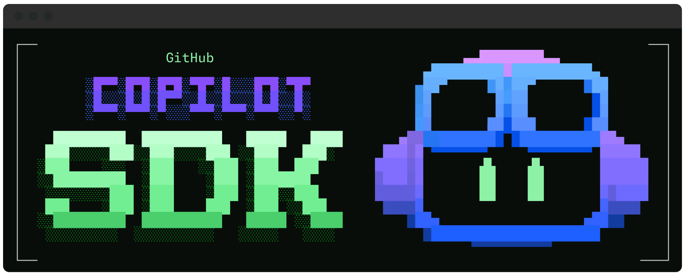

# GitHub Copilot CLI SDKs（软件开发工具包）

每个应用都能拥有自己的 Agent。

将 Copilot 的 Agent 工作流嵌入你的应用中——使用 GitHub Copilot SDK，支持 Python、TypeScript、Go、.NET、Java 和 Rust。

GitHub Copilot SDK 暴露了与 Copilot CLI 相同的底层引擎：一个经过生产环境验证的 Agent 运行时，你可以通过编程方式调用它。无需自行构建编排——你定义 Agent 的行为，Copilot 负责规划、工具调用、文件编辑等一切。

## 可用的 SDK

| SDK                      | 位置                                                                    | 示例食谱                                                                                              | 安装方式                                                                                                                                                                                                                                   | API 文档                                                                       |
| ------------------------ | ----------------------------------------------------------------------- | ----------------------------------------------------------------------------------------------------- | ------------------------------------------------------------------------------------------------------------------------------------------------------------------------------------------------------------------------------------------ | ------------------------------------------------------------------------------ |
| **Node.js / TypeScript** | [`nodejs/`](./nodejs/)                                                  | [示例食谱](https://github.com/github/awesome-copilot/blob/main/cookbook/copilot-sdk/nodejs/README.md) | `npm install @github/copilot-sdk`                                                                                                                                                                                                          |                                                                                |
| **Python**               | [`python/`](./python/)                                                  | [示例食谱](https://github.com/github/awesome-copilot/blob/main/cookbook/copilot-sdk/python/README.md) | `pip install github-copilot-sdk`                                                                                                                                                                                                           |                                                                                |
| **Go**                   | [`go/`](./go/)                                                          | [示例食谱](https://github.com/github/awesome-copilot/blob/main/cookbook/copilot-sdk/go/README.md)     | `go get github.com/github/copilot-sdk/go`                                                                                                                                                                                                  | [API 文档](https://pkg.go.dev/github.com/github/copilot-sdk/go)               |
| **.NET**                 | [`dotnet/`](./dotnet/)                                                  | [示例食谱](https://github.com/github/awesome-copilot/blob/main/cookbook/copilot-sdk/dotnet/README.md) | `dotnet add package GitHub.Copilot.SDK`                                                                                                                                                                                                    |                                                                                |
| **Rust**                 | [`rust/`](./rust/)                                                      | —                                                                                                     | `cargo add github-copilot-sdk`                                                                                                                                                                                                             | [API 文档](https://docs.rs/github-copilot-sdk/latest/github_copilot_sdk/)     |
| **Java**                 | [`java/`](./java/) | [示例食谱](https://github.com/github/awesome-copilot/blob/main/cookbook/copilot-sdk/java/README.md)                                                                                                   | Maven 坐标 `com.github:copilot-sdk-java` 详见 [Maven](./java/README.md#maven) 和 [Gradle](./java/README.md#gradle) 说明 | [API 文档](https://javadoc.io/doc/com.github/copilot-sdk-java/latest/) |

请参阅各 SDK 的 README 了解安装方式、使用示例和 API 参考。

## 快速开始

完整的入门教程请参阅 **[入门指南](./docs/getting-started.md)**。

快速步骤：

1. **（可选）安装 Copilot CLI**

对于 Node.js、Python 和 .NET SDK，Copilot CLI 会自动作为依赖捆绑安装。你无需单独安装。

对于 Go、Java 和 Rust SDK，默认**不**捆绑 CLI。你需要手动安装 Copilot CLI，或使用 SDK 的应用级 CLI 捆绑功能（Go 和 Rust 支持）。

2. **安装所选语言的 SDK**

请按上方表格中的说明安装。

3. **开始构建！**

按照 [入门指南](./docs/getting-started.md) 创建你的第一个 Copilot 驱动应用。

## 常见问题

### 我需要 GitHub Copilot 订阅吗？

不需要。你只需要安装 Copilot CLI（如上所述）。**无需** GitHub Copilot 订阅。详见 [Copilot CLI 文档](https://docs.github.com/en/copilot/using-github-copilot/using-github-copilot-cli) 了解安装和用量。

### SDK 使用的计费方式是什么？

GitHub Copilot SDK 的计费与 Copilot CLI 相同，每次提示都会计入用量配额。更多信息请参阅 [GitHub Copilot 用量与计费](https://docs.github.com/en/copilot/reference/copilot-billing/models-and-pricing)。

### 是否支持 BYOK（自带密钥）？

是的，GitHub Copilot SDK 支持 BYOK。你可以配置 SDK 使用来自支持的 LLM 提供商（例如 OpenAI、Microsoft Foundry、Anthropic）的 API 密钥，通过那些提供商访问模型。详见 **[BYOK 文档](./docs/auth/byok.md)** 了解设置说明和示例。

**注意：** BYOK 仅使用基于密钥的认证。不支持 Microsoft Entra ID（Azure AD）、托管身份和第三方身份提供商。

### 哪些认证方式受支持？

SDK 支持多种认证方式：

- **GitHub 已登录用户**——使用 `copilot` CLI 登录时存储的 OAuth 凭据
- **OAuth GitHub App**——传入你的 GitHub OAuth 应用的用户令牌
- **环境变量**——`COPILOT_GITHUB_TOKEN`、`GH_TOKEN`、`GITHUB_TOKEN`
- **BYOK（自带密钥）**——使用你自己的 API 密钥（无需 GitHub 认证）

详见 **[认证文档](./docs/auth/README.md)**。

### 我需要单独安装 Copilot CLI 吗？

不需要——对于 Node.js、Python 和 .NET SDK，Copilot CLI 会自动作为依赖捆绑安装。

对于 Go、Java 和 Rust SDK，CLI **默认不**捆绑。需要手动安装 CLI，或确保 `copilot` 在你的 PATH 中可用。Go 和 Rust 也提供了应用级 CLI 捆绑功能。

进阶：你可以覆盖 CLI 二进制文件或连接到外部服务器。详见各 SDK 的 README。

### 默认启用哪些工具？

默认情况下，SDK 暴露 Copilot CLI 的第一方工具，类似于使用 `--allow-all` 参数运行 CLI。工具执行仍受各 SDK 权限处理器的管理，应用可以批准、拒绝或自定义工具调用。你可以通过配置 SDK 客户端选项来启用或禁用特定工具。请参阅各 SDK 文档了解工具配置详情，以及 Copilot CLI 文档了解可用工具列表。

### 我可以使用自定义 Agent、技能或工具吗？

可以。GitHub Copilot SDK 允许你定义自定义 Agent、技能和工具。你可以通过实现自己的逻辑和集成额外工具来扩展 Agent 的功能。请参阅你首选语言的 SDK 文档了解更多详情。

### 是否有针对 Copilot 的指令或 SDK 指南来加速开发？

是的，请查看自定义指令和 SDK 特定指南：

- **[Node.js / TypeScript](https://github.com/github/awesome-copilot/blob/main/instructions/copilot-sdk-nodejs.instructions.md)**
- **[Python](https://github.com/github/awesome-copilot/blob/main/instructions/copilot-sdk-python.instructions.md)**
- **[.NET](https://github.com/github/awesome-copilot/blob/main/instructions/copilot-sdk-csharp.instructions.md)**
- **[Go](https://github.com/github/awesome-copilot/blob/main/instructions/copilot-sdk-go.instructions.md)**
- **[Rust](./rust/README.md)**（SDK 指南；自定义指令尚未发布）
- **[Java](https://github.com/github/awesome-copilot/blob/main/instructions/copilot-sdk-java.instructions.md)**

### 支持哪些模型？

所有通过 Copilot CLI 可用的模型在 SDK 中均受支持。SDK 还暴露了一个方法，可以在运行时返回可用模型列表。

### SDK 可以用于生产环境吗？

GitHub Copilot SDK 已正式发布（GA），并遵循语义化版本控制。详见 [CHANGELOG.md](./CHANGELOG.md) 了解发布说明。

### 如何报告问题或请求功能？

请使用 [GitHub Issues](https://github.com/github/copilot-sdk/issues) 页面报告错误或请求新功能。我们欢迎你的反馈，以帮助改进 SDK。

## 快速链接

- **[文档](./docs/README.md)**——完整文档索引
- **[入门指南](./docs/getting-started.md)**——上手教程
- **[设置指南](./docs/setup/README.md)**——架构、部署和扩展
- **[认证](./docs/auth/README.md)**——GitHub OAuth、BYOK 等
- **[功能特性](./docs/features/README.md)**——钩子、自定义 Agent、MCP、技能等
- **[故障排除](./docs/troubleshooting/debugging.md)**——常见问题与解决方案
- **[示例食谱](https://github.com/github/awesome-copilot/blob/main/cookbook/copilot-sdk)**——各语言的实用示例
- **[更多资源](https://github.com/github/awesome-copilot/blob/main/collections/copilot-sdk.md)**——更多示例、教程和社区资源

## 非官方、社区维护的 SDK

⚠️ 免责声明：以下是非官方、社区驱动的 SDK，不受 GitHub 支持。使用风险自负。

| SDK         | 位置                                                 |
| ----------- | -------------------------------------------------------- |
| **Clojure** | [copilot-community-sdk/copilot-sdk-clojure][sdk-clojure] |
| **C++**     | [0xeb/copilot-sdk-cpp][sdk-cpp]                          |

[sdk-cpp]: https://github.com/0xeb/copilot-sdk-cpp
[sdk-clojure]: https://github.com/copilot-community-sdk/copilot-sdk-clojure

## 贡献

参见 [CONTRIBUTING.md](./CONTRIBUTING.md) 了解贡献指南。

## 许可证

MIT
