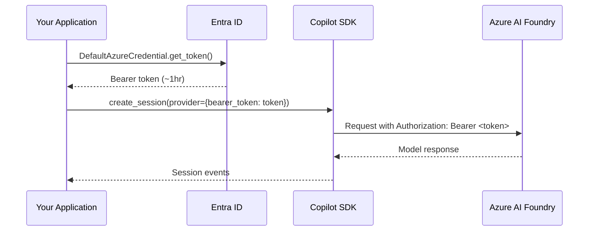

# Azure Managed Identity with BYOK

The Copilot SDK's [BYOK mode](./byok.md) accepts static API keys, but Azure deployments often use **Managed Identity** (Entra ID) instead of long-lived keys. Since the SDK doesn't natively support Entra ID authentication, you can use a short-lived bearer token via the `bearer_token` provider config field.

This guide shows how to use `DefaultAzureCredential` from the [Azure Identity](https://learn.microsoft.com/python/api/azure-identity/azure.identity.defaultazurecredential) library to authenticate with Azure AI Foundry models through the Copilot SDK.

## How It Works

Azure AI Foundry's OpenAI-compatible endpoint accepts bearer tokens from Entra ID in place of static API keys. The pattern is:

1. Use `DefaultAzureCredential` to obtain a token for the `https://cognitiveservices.azure.com/.default` scope
2. Pass the token as the `bearer_token` in the BYOK provider config
3. Refresh the token before it expires (tokens are typically valid for ~1 hour)



## Python Example

### Prerequisites

```bash
pip install github-copilot-sdk azure-identity
```

### Basic Usage

```python
import asyncio
import os

from azure.identity import DefaultAzureCredential
from copilot import CopilotClient, ProviderConfig, SessionConfig

COGNITIVE_SERVICES_SCOPE = "https://cognitiveservices.azure.com/.default"


async def main():
    # Get a token using Managed Identity, Azure CLI, or other credential chain
    credential = DefaultAzureCredential()
    token = credential.get_token(COGNITIVE_SERVICES_SCOPE).token

    foundry_url = os.environ["AZURE_AI_FOUNDRY_RESOURCE_URL"]

    client = CopilotClient()
    await client.start()

    session = await client.create_session(
        SessionConfig(
            model="gpt-4.1",
            provider=ProviderConfig(
                type="openai",
                base_url=f"{foundry_url.rstrip('/')}/openai/v1/",
                bearer_token=token,  # Short-lived bearer token
                wire_api="responses",
            ),
        )
    )

    response = await session.send_and_wait({"prompt": "Hello from Managed Identity!"})
    print(response.data.content)

    await client.stop()


asyncio.run(main())
```

### Token Refresh for Long-Running Applications

Bearer tokens expire (typically after ~1 hour). For servers or long-running agents, refresh the token before creating each session:

```python
from azure.identity import DefaultAzureCredential
from copilot import CopilotClient, ProviderConfig, SessionConfig

COGNITIVE_SERVICES_SCOPE = "https://cognitiveservices.azure.com/.default"


class ManagedIdentityCopilotAgent:
    """Copilot agent that refreshes Entra ID tokens for Azure AI Foundry."""

    def __init__(self, foundry_url: str, model: str = "gpt-4.1"):
        self.foundry_url = foundry_url.rstrip("/")
        self.model = model
        self.credential = DefaultAzureCredential()
        self.client = CopilotClient()

    def _get_session_config(self) -> SessionConfig:
        """Build a SessionConfig with a fresh bearer token."""
        token = self.credential.get_token(COGNITIVE_SERVICES_SCOPE).token
        return SessionConfig(
            model=self.model,
            provider=ProviderConfig(
                type="openai",
                base_url=f"{self.foundry_url}/openai/v1/",
                bearer_token=token,
                wire_api="responses",
            ),
        )

    async def chat(self, prompt: str) -> str:
        """Send a prompt and return the response text."""
        # Fresh token for each session
        config = self._get_session_config()
        session = await self.client.create_session(config)

        response = await session.send_and_wait({"prompt": prompt})
        await session.destroy()

        return response.data.content if response else ""
```

## Node.js / TypeScript Example

<!-- docs-validate: skip -->
```typescript
import { DefaultAzureCredential } from "@azure/identity";
import { CopilotClient } from "@github/copilot-sdk";

const credential = new DefaultAzureCredential();
const tokenResponse = await credential.getToken(
  "https://cognitiveservices.azure.com/.default"
);

const client = new CopilotClient();

const session = await client.createSession({
  model: "gpt-4.1",
  provider: {
    type: "openai",
    baseUrl: `${process.env.AZURE_AI_FOUNDRY_RESOURCE_URL}/openai/v1/`,
    bearerToken: tokenResponse.token,
    wireApi: "responses",
  },
});

const response = await session.sendAndWait({ prompt: "Hello!" });
console.log(response?.data.content);

await client.stop();
```

## .NET Example

<!-- docs-validate: skip -->
```csharp
using Azure.Identity;
using GitHub.Copilot;

var credential = new DefaultAzureCredential();
var token = await credential.GetTokenAsync(
    new Azure.Core.TokenRequestContext(
        new[] { "https://cognitiveservices.azure.com/.default" }));

await using var client = new CopilotClient();
var foundryUrl = Environment.GetEnvironmentVariable("AZURE_AI_FOUNDRY_RESOURCE_URL");

await using var session = await client.CreateSessionAsync(new SessionConfig
{
    Model = "gpt-4.1",
    Provider = new ProviderConfig
    {
        Type = "openai",
        BaseUrl = $"{foundryUrl!.TrimEnd('/')}/openai/v1/",
        BearerToken = token.Token,
        WireApi = "responses",
    },
});

var response = await session.SendAndWaitAsync(
    new MessageOptions { Prompt = "Hello from Managed Identity!" });
Console.WriteLine(response?.Data.Content);
```

## Environment Configuration

| Variable | Description | Example |
|----------|-------------|---------|
| `AZURE_AI_FOUNDRY_RESOURCE_URL` | Your Azure AI Foundry resource URL | `https://myresource.openai.azure.com` |

No API key environment variable is needed — authentication is handled by `DefaultAzureCredential`, which automatically supports:

- **Managed Identity** (system-assigned or user-assigned) — for Azure-hosted apps
- **Azure CLI** (`az login`) — for local development
- **Environment variables** (`AZURE_CLIENT_ID`, `AZURE_TENANT_ID`, `AZURE_CLIENT_SECRET`) — for service principals
- **Workload Identity** — for Kubernetes

See the [DefaultAzureCredential documentation](https://learn.microsoft.com/python/api/azure-identity/azure.identity.defaultazurecredential) for the full credential chain.

## When to Use This Pattern

| Scenario | Recommendation |
|----------|----------------|
| Azure-hosted app with Managed Identity | ✅ Use this pattern |
| App with existing Azure AD service principal | ✅ Use this pattern |
| Local development with `az login` | ✅ Use this pattern |
| Non-Azure environment with static API key | Use [standard BYOK](./byok.md) |
| GitHub Copilot subscription available | Use [GitHub OAuth](./github-oauth.md) |

## See Also

- [BYOK Setup Guide](./byok.md) — Static API key configuration
- [Backend Services](./backend-services.md) — Server-side deployment
- [Azure Identity documentation](https://learn.microsoft.com/python/api/overview/azure/identity-readme)
