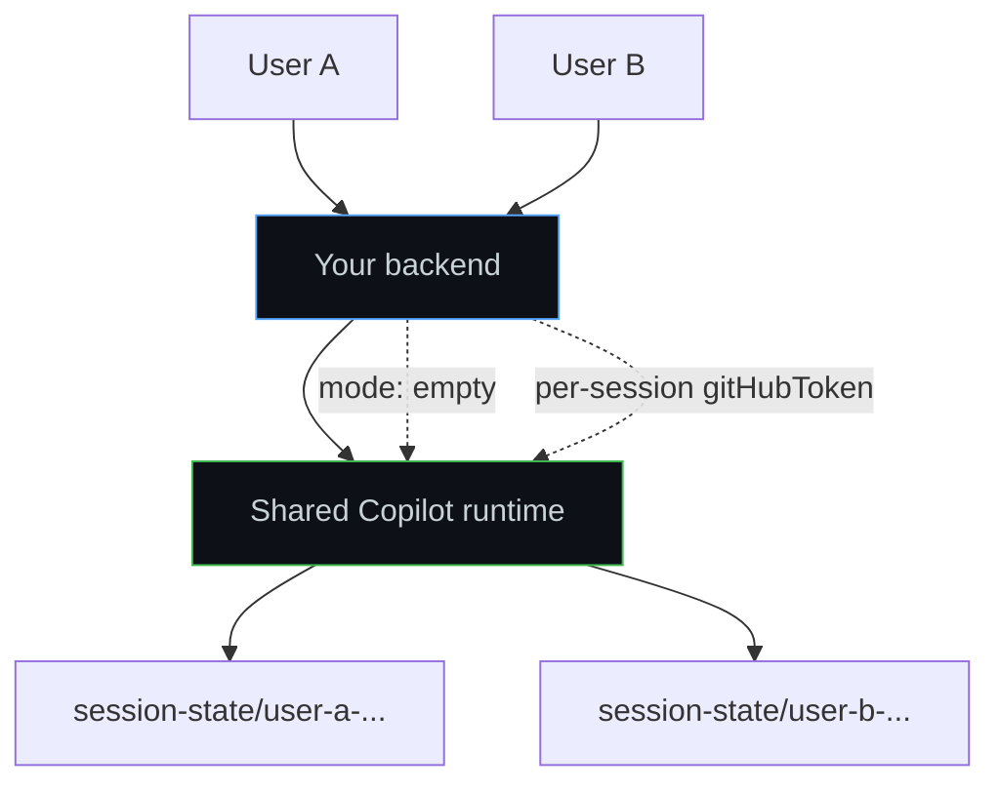

# Multi-tenancy and server deployments

Multi-user server mode means running the Copilot SDK from backend code that serves more than one human, tenant, workspace, or integration account. In this setup, the application owns request routing and authorization, while the SDK and runtime provide per-session state, per-session authentication, and explicit tool registration so one user's session does not inherit another user's tools or identity.

**Best for:** SaaS products, partner integrations, internal platforms, and backend services that handle concurrent users.

## Use this guide when

Use this guide when you are building:

* A multi-user SaaS product that embeds Copilot-powered agents
* A backend for a partner integration, such as a Copilot Studio or Fabric-style pattern
* Any server that handles concurrent users, workspaces, tenants, or requests
* A shared runtime where multiple SDK clients connect to one Copilot runtime process

This guide is a sister to [Scaling and multi-tenancy](./scaling.md). Use that guide for topology, load-balancing, and storage patterns. Use this guide for SDK-level options and runtime isolation choices.

## Key SDK options

| Option | Use it for | Notes |
|--------|------------|-------|
| `mode: "empty"` | Disabling ambient OS tools and CLI defaults | Required for multi-user or shared scenarios. |
| `sessionIdleTimeoutSeconds` | Cleaning idle sessions | Set a server-side timeout for long-running processes. |
| `baseDirectory` | Isolating `COPILOT_HOME` per runtime instance | Ignored when connecting to an existing runtime. |
| `sessionFs` | Routing session filesystem storage off local disk | Pair with per-session filesystem providers. |
| `RuntimeConnection.forUri(url)` | Sharing one already-running runtime | Language names vary; see samples below. |
| Per-session `gitHubToken` | Scoping auth to the requesting user | Prefer this over a single shared user token. |

### `mode: "empty"`

`mode: "empty"` disables optional Copilot CLI behavior by default. In multi-user server mode, this is the safe baseline because your application must explicitly decide which tools, MCP servers, skills, and workspace paths a session can access.

Do not use the default `mode: "copilot-cli"` for shared servers. That mode is intended for CLI-like coding agents and can expose ambient host filesystem capabilities.

<details open>
<summary><strong>TypeScript</strong></summary>

```typescript
import { CopilotClient, RuntimeConnection } from "@github/copilot-sdk";

const client = new CopilotClient({
    mode: "empty",
    baseDirectory: `/var/lib/my-app/copilot/${runtimeInstanceId}`,
    sessionIdleTimeoutSeconds: 900,
    connection: RuntimeConnection.forUri(process.env.COPILOT_RUNTIME_URL!),
});

const session = await client.createSession({
    sessionId: `user-${user.id}-${crypto.randomUUID()}`,
    model: "gpt-4.1",
    availableTools: ["custom:lookupOrder", "custom:createTicket"],
    gitHubToken: user.githubToken,
});
```

</details>

<details>
<summary><strong>Python</strong></summary>

```python
from copilot import CopilotClient, RuntimeConnection
from copilot.session import PermissionHandler

client = CopilotClient(
    mode="empty",
    base_directory=f"/var/lib/my-app/copilot/{runtime_instance_id}",
    session_idle_timeout_seconds=900,
    connection=RuntimeConnection.for_uri(runtime_url),
)
await client.start()

session = await client.create_session(
    session_id=f"user-{user.id}-{request_id}",
    model="gpt-4.1",
    available_tools=["custom:lookupOrder", "custom:createTicket"],
    github_token=user.github_token,
    on_permission_request=PermissionHandler.approve_all,
)
```

</details>

<details>
<summary><strong>Go</strong></summary>

<!-- docs-validate: hidden -->
```go
package main

import (
	"context"
	"fmt"

	copilot "github.com/github/copilot-sdk/go"
)

type appUser struct {
	ID          string
	GitHubToken string
}

func main() {
	ctx := context.Background()
	runtimeInstanceID := "instance-1"
	runtimeURL := "http://127.0.0.1:8080"
	requestID := "req-1"
	user := appUser{ID: "alice", GitHubToken: "gho_xxx"}

	client := copilot.NewClient(&copilot.ClientOptions{
		Mode:                      copilot.ModeEmpty,
		BaseDirectory:             fmt.Sprintf("/var/lib/my-app/copilot/%s", runtimeInstanceID),
		SessionIdleTimeoutSeconds: 900,
		Connection:                copilot.UriConnection{URL: runtimeURL},
	})

	session, err := client.CreateSession(ctx, &copilot.SessionConfig{
		SessionID:      fmt.Sprintf("user-%s-%s", user.ID, requestID),
		Model:          "gpt-4.1",
		AvailableTools: []string{"custom:lookupOrder", "custom:createTicket"},
		GitHubToken:    user.GitHubToken,
	})
	_ = session
	_ = err
}
```
<!-- /docs-validate: hidden -->

```go
client := copilot.NewClient(&copilot.ClientOptions{
    Mode:                      copilot.ModeEmpty,
    BaseDirectory:             fmt.Sprintf("/var/lib/my-app/copilot/%s", runtimeInstanceID),
    SessionIdleTimeoutSeconds: 900,
    Connection:                copilot.UriConnection{URL: runtimeURL},
})

session, err := client.CreateSession(ctx, &copilot.SessionConfig{
    SessionID:      fmt.Sprintf("user-%s-%s", user.ID, requestID),
    Model:          "gpt-4.1",
    AvailableTools: []string{"custom:lookupOrder", "custom:createTicket"},
    GitHubToken:    user.GitHubToken,
})
```

</details>

<details>
<summary><strong>.NET</strong></summary>

<!-- docs-validate: hidden -->
```csharp
using GitHub.Copilot;

var runtimeInstanceId = "instance-1";
var runtimeUrl = "http://127.0.0.1:8080";
var requestId = "req-1";
var user = new { Id = "alice", GitHubToken = "gho_xxx" };

var client = new CopilotClient(new CopilotClientOptions
{
    Mode = CopilotClientMode.Empty,
    BaseDirectory = $"/var/lib/my-app/copilot/{runtimeInstanceId}",
    SessionIdleTimeoutSeconds = 900,
    Connection = RuntimeConnection.ForUri(runtimeUrl),
});

await using var session = await client.CreateSessionAsync(new SessionConfig
{
    SessionId = $"user-{user.Id}-{requestId}",
    Model = "gpt-4.1",
    AvailableTools = ["custom:lookupOrder", "custom:createTicket"],
    GitHubToken = user.GitHubToken,
});
```
<!-- /docs-validate: hidden -->

```csharp
var client = new CopilotClient(new CopilotClientOptions
{
    Mode = CopilotClientMode.Empty,
    BaseDirectory = $"/var/lib/my-app/copilot/{runtimeInstanceId}",
    SessionIdleTimeoutSeconds = 900,
    Connection = RuntimeConnection.ForUri(runtimeUrl),
});

await using var session = await client.CreateSessionAsync(new SessionConfig
{
    SessionId = $"user-{user.Id}-{requestId}",
    Model = "gpt-4.1",
    AvailableTools = ["custom:lookupOrder", "custom:createTicket"],
    GitHubToken = user.GitHubToken,
});
```

</details>

<details>
<summary><strong>Java</strong></summary>

```java
import java.util.List;
import com.github.copilot.CopilotClient;
import com.github.copilot.rpc.*;

var client = new CopilotClient(new CopilotClientOptions()
    .setMode(CopilotClientMode.EMPTY)
    .setCopilotHome("/var/lib/my-app/copilot/" + runtimeInstanceId)
    .setSessionIdleTimeoutSeconds(900)
    .setCliUrl(runtimeUrl)
);

var session = client.createSession(new SessionConfig()
    .setSessionId("user-" + user.id() + "-" + requestId)
    .setModel("gpt-4.1")
    .setAvailableTools(List.of("custom:lookupOrder", "custom:createTicket"))
    .setGitHubToken(user.gitHubToken())
).get();
```

</details>

<details>
<summary><strong>Rust</strong></summary>

```rust
use std::path::PathBuf;
use github_copilot_sdk::{Client, ClientOptions, Transport};
use github_copilot_sdk::mode::ClientMode;
use github_copilot_sdk::types::SessionConfig;

let client = Client::start(
    ClientOptions::new()
        .with_mode(ClientMode::Empty)
        .with_base_directory(PathBuf::from(format!(
            "/var/lib/my-app/copilot/{runtime_instance_id}"
        )))
        .with_session_idle_timeout_seconds(900)
        .with_transport(Transport::External {
            host: runtime_host.to_string(),
            port: runtime_port,
            connection_token: None,
        }),
).await?;

let session = client.create_session(
    SessionConfig::default()
        .with_session_id(format!("user-{}-{request_id}", user.id))
        .with_model("gpt-4.1")
        .with_available_tools(["custom:lookupOrder", "custom:createTicket"])
        .with_github_token(user.github_token),
).await?;
```

</details>

### `sessionIdleTimeoutSeconds`

Set `sessionIdleTimeoutSeconds` on servers so inactive sessions are cleaned up automatically. This prevents zombie sessions in long-running processes and reduces memory and filesystem pressure.

| Language | Public option |
|----------|---------------|
| TypeScript | `sessionIdleTimeoutSeconds` |
| Python | `session_idle_timeout_seconds` |
| Go | `SessionIdleTimeoutSeconds` |
| .NET | `SessionIdleTimeoutSeconds` |
| Java | `setSessionIdleTimeoutSeconds(...)` |
| Rust | `with_session_idle_timeout_seconds(...)` |

Use a value that matches your product's conversation lifetime. For chat backends, 15 to 30 minutes is usually a good starting point. For workflow agents, use a longer timeout and explicit deletion when the workflow completes.

### `baseDirectory`

`baseDirectory` sets `COPILOT_HOME` for a runtime instance. Use it to isolate runtime state, credentials, and session data per process, pod, worker, or tenant boundary.

```typescript
const client = new CopilotClient({
    mode: "empty",
    baseDirectory: `/var/lib/my-app/copilot/runtime-${process.env.HOSTNAME}`,
    sessionIdleTimeoutSeconds: 900,
});
```

The runtime stores session state under the configured `COPILOT_HOME`, including `session-state/{sessionId}`. If your app runs multiple runtime instances, give each instance a distinct directory unless you intentionally use shared storage.

When the SDK connects to an already-running runtime with `RuntimeConnection.forUri(url)`, `baseDirectory` is ignored by the SDK client. Configure `COPILOT_HOME` on the runtime process instead.

### `sessionFs`

`sessionFs` registers a custom session filesystem provider so session-scoped file I/O can be routed through application storage instead of the runtime's local disk. Use it when local disk is ephemeral, when session state needs to live in object storage, or when a platform needs to enforce tenant-aware storage paths.

```typescript
const client = new CopilotClient({
    mode: "empty",
    sessionFs: {
        initialWorkingDirectory: "/workspace",
        sessionStatePath: "/session-state",
        conventions: "posix",
    },
});
```

For languages that expose a provider callback, configure `sessionFs` at the client level and provide a per-session filesystem handler when creating or resuming a session. See [Session Persistence](../features/session-persistence.md) for persistence concepts and storage trade-offs.

Verified public SDK surfaces:

| Language | Client-level config | Per-session provider |
|----------|---------------------|----------------------|
| TypeScript | `sessionFs` | `createSessionFsAdapter` / provider callbacks |
| Python | `session_fs` | `create_session_fs_handler` |
| Go | `SessionFs` | `CreateSessionFsProvider` |
| .NET | `SessionFs` | `CreateSessionFsProvider` |
| Rust | `with_session_fs(...)` | `with_session_fs_provider(...)` |

Java does not currently expose a verified public `sessionFs` option, so this guide does not show a Java `sessionFs` sample.

### `RuntimeConnection.forUri(url)`

Use an external runtime connection when multiple SDK clients should share one already-running runtime. This is common in backend services where the runtime process is managed separately from request handlers.

| Language | External runtime connection |
|----------|-----------------------------|
| TypeScript | `RuntimeConnection.forUri(url)` or `cliUrl` |
| Python | `RuntimeConnection.for_uri(url)` |
| Go | `copilot.UriConnection{URL: url}` |
| .NET | `RuntimeConnection.ForUri(url)` |
| Java | `setCliUrl(url)` |
| Rust | `Transport::External { host, port, connection_token }` |

External runtimes manage their own process-level authentication and storage. Pass per-session tokens on `createSession` or `resumeSession` when you need user-specific auth.

### Per-session `gitHubToken`

Set `gitHubToken` on each session to scope GitHub auth to the requesting user. This is different from a client-level token, which authenticates the runtime process.

```typescript
const session = await client.createSession({
    sessionId: `user-${user.id}-support`,
    model: "gpt-4.1",
    availableTools: ["custom:*"],
    gitHubToken: user.githubToken,
});
```

Use per-session tokens for content exclusion, model routing, quota checks, and user-specific Copilot access. Avoid sharing one service token across users unless your product intentionally uses service-account semantics.

## Integration ID

Partners building branded agents can set an integration ID for Mission Control requests. The runtime reads `GITHUB_COPILOT_INTEGRATION_ID` and stamps it as the `Copilot-Integration-Id` HTTP header on every Mission Control request.

```bash
GITHUB_COPILOT_INTEGRATION_ID=my-product-agent copilot --headless --port 4321
```

The default integration ID is `copilot-developer-cli`. Use a stable value such as `my-product-agent` for attribution and routing. The integration ID is currently configured by environment variable only; it is not a first-class SDK option.

If the SDK spawns the runtime, pass the environment variable through the client environment option. If you connect with `RuntimeConnection.forUri(url)`, set the environment variable on the runtime process itself.

## Session-level isolation guarantees

Session-level isolation means the runtime keeps user-specific model and state information scoped to a session, not in global shared state.

| Surface | Isolation behavior |
|---------|--------------------|
| Model list cache | Per-session. Model lookup uses the session's model list cache. |
| Session state | Per session ID under `COPILOT_HOME/session-state/{sessionId}`. |
| GitHub identity | Per-session when `gitHubToken` is set on the session. |
| Tools | Explicit in `mode: "empty"`; ambient in `mode: "copilot-cli"`. |
| Host filesystem | Shared by the runtime process if host tools are available. |

`mode: "empty"` is what makes shared runtime patterns viable: no ambient OS tools are exposed unless your application registers or allows them. With `mode: "copilot-cli"`, OS filesystem access is shared through the host process, so do not use that mode for multi-user server mode.

Session state is stored under `COPILOT_HOME/session-state/{sessionId}` unless you route it through `sessionFs`. Use unique session IDs that include your own tenant or user boundary, and enforce access control before resuming or deleting sessions.

## Pattern comparison

| Pattern | Use when | Trade-offs |
|---------|----------|------------|
| Pattern 1: isolated CLI per user | You need the strongest isolation boundary or separate process credentials per user. | Strong isolation; higher resource cost. See [Scaling and multi-tenancy](./scaling.md). |
| Pattern 2: shared CLI with `mode: "empty"` | You want one runtime to serve many users while your app controls tools, auth, and session IDs. | Efficient; requires careful tool registration, per-session tokens, and application-level access checks. |
| Pattern 3: hybrid | You route compute-heavy work to cloud sessions and light work to local sessions. | Flexible; requires workload routing and policy handling. See [Cloud Sessions](../features/cloud-sessions.md). |

### Pattern 2: shared CLI with `mode: "empty"`

In this pattern, all users connect through your backend to one runtime pool. The application performs user authentication, chooses a session ID, passes the user's GitHub token on the session, and provides an explicit tool allowlist.



Use these rules:

* Always start the client or runtime in `mode: "empty"`.
* Use unique session IDs and store ownership metadata in your application database.
* Check ownership before `resumeSession`, `deleteSession`, or any UI action that references a session ID.
* Pass `gitHubToken` per session when requests should run as the user.
* Register only the tools the session needs, and prefer source-qualified allowlists such as `custom:*` or `mcp:search_docs`.
* Set `sessionIdleTimeoutSeconds` and delete completed workflow sessions explicitly.

## Common pitfalls

* Forgetting `mode: "empty"`. The default `copilot-cli` mode exposes CLI-style behavior and may expose the host filesystem through ambient tools.
* Not setting `sessionIdleTimeoutSeconds`. Long-running servers can accumulate idle sessions if they do not clean them up.
* Sharing one `gitHubToken` across users instead of passing a per-session token.
* Trusting client-provided session IDs without checking ownership in your backend.
* Setting `baseDirectory` on a client that connects to an existing runtime and expecting it to move runtime storage. Configure the runtime process instead.
* Allowing broad tool patterns such as `builtin:*` without reviewing whether each tool is appropriate for your users.

## See also

* [Scaling and multi-tenancy](./scaling.md): deployment topologies, storage patterns, and isolation comparisons
* [Backend services setup](./backend-services.md): running the runtime in headless server mode
* [BYOK](../auth/byok.md): using your own model provider credentials
* [Cloud Sessions](../features/cloud-sessions.md): routing selected work to cloud sessions
* [Session Persistence](../features/session-persistence.md): managing resumable session state
* [Features overview](../features/index.md): tools, events, hooks, and advanced SDK features
